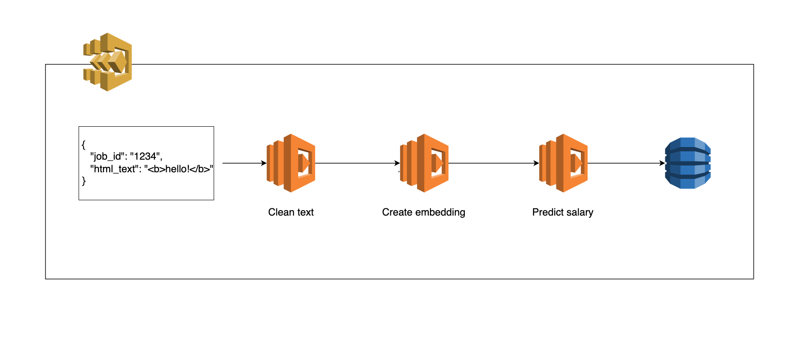

# AWS StepFunctions Demo

A simple enrichment pipeline based on AWS StepFunctions and deployed through CDK



## Prerequisites
* Python 3.9+ . [Installing through pyenv](https://github.com/pyenv/pyenv) is recommended
* [Poetry](https://python-poetry.org/docs/master/#installation)
* [NodeJs](https://nodejs.org/en/)
* [AWS CDK CLI](https://docs.aws.amazon.com/cdk/latest/guide/cli.html)
* [Docker](https://docs.docker.com/get-docker/)

## Development
### Set up project
```bash
make init
```
### Test
Run test in local machine 
```bash
make test
```

Run test in Docker
```bash
make docker-test
```

### Deploy
Deploy in local machine 
```bash
make deploy
```

Deploy in Docker
```bash
make docker-deploy
```
